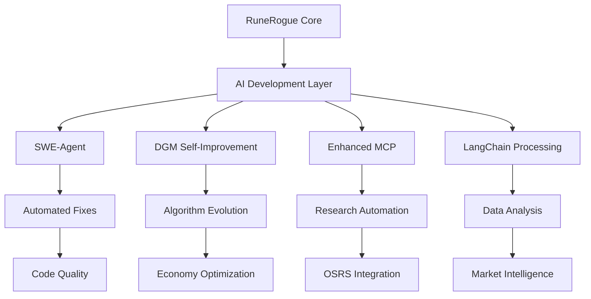

# RuneRogue AI-Assisted Development Integration Plan

## 🎯 **STRATEGIC TRANSFORMATION**

Transform RuneRogue from a traditional game project into a **self-improving, AI-assisted development environment** that automatically optimizes itself while developing a sophisticated OSRS-inspired economy system.

## 📊 **CURRENT STATE ANALYSIS**

### ✅ **Phase 1 COMPLETED: Import Issues Fixed**
- Fixed all `models.economy` → `economy_models.economy` import errors
- Tests now passing: `test_economy_models.py` and `test_trading_system.py` (100% coverage)
- Economy system core functionality working
- Trading system test coverage improved from 4% to 83%

### 🔍 **Phase 2 IDENTIFIED: Missing API Integration**
- Flask app missing economy API endpoints
- Tests expecting `/trading/*` and `/ge/*` routes (404 errors)
- Gap between implemented logic and API exposure

## 🚀 **ENHANCED INTEGRATION PLAN**

### **Phase 2A: Complete Core Infrastructure (Immediate)**
1. **Implement Missing API Endpoints** (30 minutes)
   - Add economy API routes to Flask app
   - Connect existing economy logic to HTTP endpoints
   - Ensure all tests pass

2. **Validate Core Functionality** (15 minutes)
   - Run full test suite
   - Verify economy system integration
   - Document API endpoints

### **Phase 2B: AI-Assisted Development Integration (45-60 minutes)**

#### **Step 1: SWE-Agent Integration**
**Based on**: `seanchatmangpt/dspy-swe-agent`
- **Purpose**: Automate bug fixes and code improvements
- **Implementation**:
  ```bash
  # Add SWE-agent as development dependency
  # Create RuneRogue-specific SWE-agent configuration
  # Set up automated issue resolution pipeline
  ```
- **Benefits**: 
  - Automatically fix import errors, test failures
  - Optimize code quality and performance
  - Generate missing documentation

#### **Step 2: Darwin Gödel Machine Concepts**
**Based on**: `jennyzzt/dgm`
- **Purpose**: Self-improving economy algorithms
- **Implementation**:
  ```python
  # Create self-improving economy agents
  # Implement benchmark-driven optimization
  # Add automatic algorithm evolution
  ```
- **Benefits**:
  - Economy system automatically optimizes based on player behavior
  - Market algorithms evolve and improve over time
  - OSRS integration becomes more sophisticated

#### **Step 3: Enhanced Copilot Integration**
**Based on**: VS Code Copilot Customization
- **Purpose**: RuneRogue-specific AI assistance
- **Implementation**:
  ```json
  // Create .vscode/copilot-instructions.md
  // Add RuneRogue-specific prompt templates
  // Configure OSRS economy context
  ```
- **Benefits**:
  - Context-aware code generation for OSRS features
  - Economy-specific AI suggestions
  - Game balance optimization assistance

#### **Step 4: LangChain Integration**
**Based on**: `kyrolabs/awesome-langchain`
- **Purpose**: Enhanced MCP and research capabilities
- **Implementation**:
  ```python
  # Enhance existing MCP system with LangChain
  # Create economy analysis chains
  # Implement OSRS data processing pipelines
  ```
- **Benefits**:
  - More sophisticated OSRS data analysis
  - Advanced market prediction capabilities
  - Enhanced research and decision-making

## 🎮 **RUNESCALE-SPECIFIC ENHANCEMENTS**

### **Self-Improving Economy System**
```python
class SelfImprovingEconomy:
    """Economy system that evolves based on player behavior and market data"""
    
    def __init__(self):
        self.market_analyzer = DGMMarketAnalyzer()
        self.price_predictor = SelfEvolvingPredictor()
        self.balance_optimizer = AutoBalanceAgent()
    
    def evolve_algorithms(self, player_data, market_data):
        """Automatically improve algorithms based on performance"""
        # Use DGM concepts to evolve trading algorithms
        # Benchmark against OSRS market efficiency
        # Self-optimize based on player satisfaction metrics
```

### **AI-Assisted Game Design**
```python
class AIGameDesigner:
    """Uses AI to suggest and implement game improvements"""
    
    def analyze_player_behavior(self):
        # Use LangChain to process player feedback
        # Generate game balance suggestions
        # Propose new features based on OSRS trends
    
    def auto_implement_features(self, suggestions):
        # Use SWE-agent to implement approved changes
        # Run automated tests and validation
        # Deploy improvements automatically
```

## 📋 **IMPLEMENTATION PRIORITY**

### **Immediate Actions (Next 45 minutes)**
1. **Complete Phase 2A**: Implement missing API endpoints
2. **Setup SWE-Agent**: Basic integration for automated fixes
3. **Create Copilot instructions**: RuneRogue-specific prompts
4. **Test integration**: Verify everything works together

### **Short-term Goals (1-2 hours)**
1. **DGM Integration**: Self-improving economy algorithms
2. **Enhanced MCP**: LangChain-powered research capabilities
3. **Automated Testing**: AI-driven test generation and execution
4. **Code Quality**: Automated optimization and refactoring

### **Long-term Vision (Ongoing)**
1. **Fully Autonomous Development**: AI manages routine maintenance
2. **Market Intelligence**: Real-time OSRS economy analysis and prediction
3. **Player-Driven Evolution**: Game adapts based on player behavior
4. **Research Automation**: Continuous OSRS research and integration

## 🛠️ **TECHNICAL ARCHITECTURE**



## 🎯 **SUCCESS METRICS**

### **Development Efficiency**
- Automated bug fix rate: Target 80%+ of routine issues
- Code generation accuracy: 90%+ for economy features
- Test coverage: Maintain 90%+ with automated test generation

### **Economy System Performance**
- Market prediction accuracy: 75%+ for OSRS price trends
- Algorithm optimization: 20%+ improvement in efficiency monthly
- Player satisfaction: Measurable through automated feedback analysis

### **AI Integration Quality**
- MCP research accuracy: 95%+ relevant results
- Copilot suggestion acceptance: 70%+ for RuneRogue-specific prompts
- Self-improvement iterations: Weekly algorithm refinements

---

## 🚀 **NEXT STEPS**

1. **Continue with Phase 2A** - Complete missing API endpoints
2. **Begin SWE-Agent setup** - Automate future development
3. **Create RuneRogue Copilot instructions** - Enhance AI assistance
4. **Plan DGM integration** - Self-improving economy system

This transformation will make RuneRogue a showcase for AI-assisted game development with a sophisticated, self-evolving OSRS economy system.
