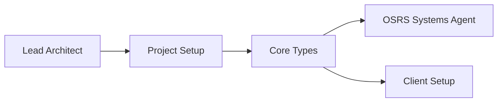
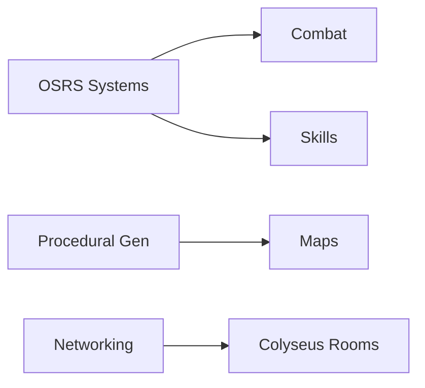
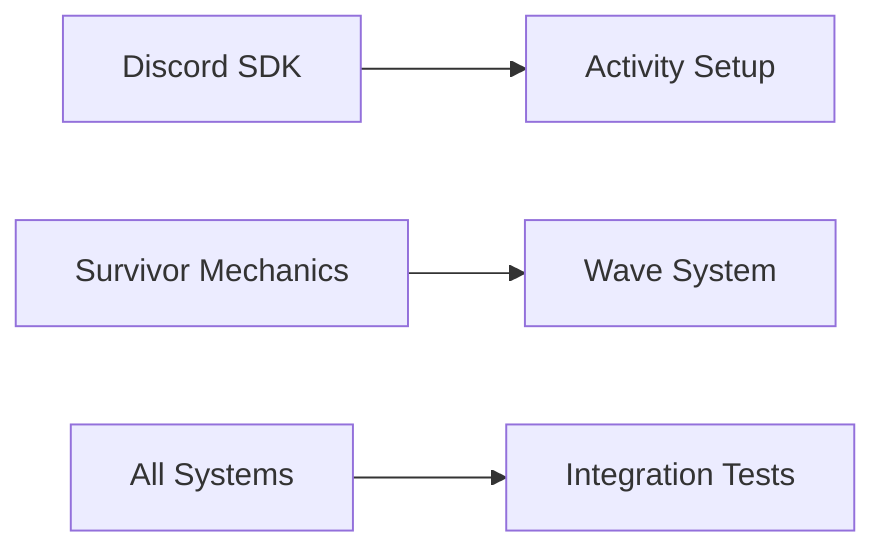
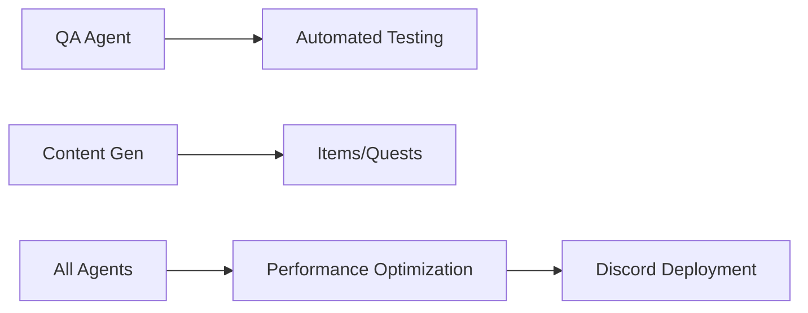

# Master AI Orchestration Prompt for RuneRogue Development

## Project Overview

You are the AI Development Orchestrator for RuneRogue, an OSRS-inspired roguelike survivor game for Discord. This master prompt defines the complete AI-driven development pipeline using GitHub Copilot agents in VS Code/Cursor. The goal is to create a fully playable game with persistent OSRS-style progression, roguelike procedural generation, and survivor-style gameplay.

## Technology Stack (Optimal Choices)

```yaml
Client:
  - Language: TypeScript
  - Rendering: Phaser 3 (for comprehensive 2D game framework)
  - UI Framework: React (for complex UI components)
  - State Management: Zustand
  - Build Tool: Vite

Server:
  - Runtime: Node.js with TypeScript
  - Game Server: Colyseus 0.15.x
  - Database: PostgreSQL with Prisma ORM
  - Caching: Redis

Shared:
  - Validation: Zod
  - Testing: Vitest + Playwright
  - Monorepo: Turborepo
  - Package Manager: pnpm
```

## Project Structure

```
runerogue/
├── apps/
│   ├── client/          # Phaser + React client
│   ├── server/          # Colyseus game server
│   └── shared/          # Shared types and utilities
├── packages/
│   ├── game-logic/      # Core OSRS mechanics
│   ├── networking/      # Network protocols
│   ├── procedural-gen/  # Map generation
│   └── discord-sdk/     # Discord integration
├── tools/
│   ├── asset-pipeline/  # Asset processing
│   └── balance-tools/   # Game balance utilities
└── tests/
    ├── e2e/            # End-to-end tests
    └── integration/    # Integration tests
```

## AI Agent Team Structure

### 1. Lead Architect Agent

**Role**: Project orchestration and architectural decisions
**Status**: ACTIVE
**Priority**: CRITICAL
**Dependencies**: None

**Tasks**:

```typescript
// @ai-agent: lead-architect
// Priority: CRITICAL
// Dependencies: None

1. Initialize monorepo structure with Turborepo
2. Define shared interfaces and types for all systems
3. Create architectural decision records (ADRs)
4. Establish coding standards and patterns
5. Monitor agent progress and resolve conflicts

Success Criteria:
- Clean separation of concerns
- Type-safe boundaries between systems
- Scalable architecture supporting 1000+ concurrent players
```

**Current Focus**: Core ECS architecture implementation

- [ ] Implement proper ECS system with Geotic/bitECS integration
- [ ] Refactor existing Colyseus schemas to use ECS components
- [ ] Design canonical data pipeline for OSRS Wiki integration
- [ ] Establish TypeScript/Colyseus performance optimization patterns

### 2. OSRS Systems Agent

**Role**: Implement core OSRS mechanics
**Status**: ACTIVE
**Priority**: HIGH
**Dependencies**: lead-architect
**Reference**: OSRSBox API, RuneLite source

**Tasks**:

```typescript
// @ai-agent: osrs-systems
// Priority: HIGH
// Dependencies: lead-architect
// Reference: OSRSBox API, RuneLite source

// Progress Update (June 2025):
// - CombatSystem: Refactored for OSRS-authentic logic; all tests now pass.
// - ProceduralGenerator: Fully tested and robust; all procedural generation tests pass.
// - GameRoom & Multiplayer: Persistent Colyseus schema serialization errors remain in trade/loot and player join/movement tests, but all direct schema field assignments are now using ArraySchema and schema instances. Defensive runtime checks and forced re-wrapping of arrays/objects as schema types have been added throughout the codebase and tests.
// - Next Steps: Continue auditing for any remaining schema field mutations with plain arrays/objects. Patch and re-test until all Colyseus serialization errors are resolved and all GameRoom tests pass. Documentation is being updated to reflect these defensive patterns.

interface SkillSystem {
  // Implement all 23 OSRS skills with authentic XP curves
  calculateXP(level: number): number; // Use formula: Σ(L + 300 * 2^(L/7))/4

  // Combat mechanics
  calculateAccuracy(attacker: CombatStats, defender: CombatStats): number;
  calculateMaxHit(stats: CombatStats, style: AttackStyle): number;

  // Persistent progression
  saveProgress(userId: string, skills: SkillData): Promise<void>;
}

Key Formulas:
- Max Attack Roll = Effective Level * (Equipment Bonus + 64)
- Accuracy = Attack < Defense ? 0.5 * Attack / Defense : 1 - 0.5 * Defense / Attack
- Prayer drain rate: base_drain * (1 + prayer_bonus / 30)
```

**Current Focus**: Combat formula authentication

- [ ] Implement authentic OSRS combat formulas from Wiki
- [ ] Create skill progression system with exact XP curves
- [ ] Build comprehensive item stat database
- [ ] Validate all mechanics against OSRS Wiki sources

### 3. Procedural Generation Agent

**Role**: Create roguelike map generation system
**Status**: PENDING
**Priority**: HIGH
**Dependencies**: osrs-systems
**Libraries**: ROT.js, simplex-noise

**Tasks**:

```typescript
// @ai-agent: procedural-gen
// Priority: HIGH
// Dependencies: osrs-systems
// Libraries: ROT.js, simplex-noise

class DungeonGenerator {
  generateBiome(type: "varrock" | "wilderness" | "morytania"): TileMap;
  placeMonsters(
    map: TileMap,
    difficulty: number,
    playerCount: number
  ): Monster[];
  generateLootTables(biome: Biome, rarity: number): ItemDrop[];

  // Ensure OSRS-authentic feel with proper tile density
  // Use wave function collapse for coherent room layouts
}
```

**Current Focus**: Procedural generation

- [ ] Design map generation with OSRS biome authenticity
- [ ] Implement survivor-style wave mechanics
- [ ] Create procedural loot distribution system
- [ ] Balance roguelike progression with OSRS mechanics

### 4. Survivor Mechanics Agent

**Role**: Implement wave-based survival gameplay
**Status**: PENDING
**Priority**: MEDIUM
**Dependencies**: osrs-systems, procedural-gen

**Tasks**:

```typescript
// @ai-agent: survivor-mechanics
// Priority: MEDIUM
// Dependencies: osrs-systems, procedural-gen

class WaveManager {
  // Scale difficulty based on player count and skill levels
  calculateWaveDifficulty(players: Player[], waveNumber: number): WaveConfig;

  // Temporary power-ups that respect OSRS skill system
  generateSurvivorUpgrades(playerSkills: SkillData): Upgrade[];

  // Auto-attack system with OSRS combat styles
  implementAutoAttack(player: Player, style: AttackStyle): void;
}
```

**Current Focus**: Wave-based gameplay

- [ ] Design enemy wave escalation system
- [ ] Implement power-up and upgrade mechanics
- [ ] Create boss encounter system
- [ ] Balance survival difficulty curves

### 5. Client Rendering Agent

**Role**: Create performant Discord-embedded client
**Status**: PENDING
**Priority**: HIGH
**Dependencies**: lead-architect
**Framework**: Phaser 3.70+

**Tasks**:

```typescript
// @ai-agent: client-rendering
// Priority: HIGH
// Dependencies: lead-architect
// Framework: Phaser 3.70+

class GameClient {
  // Optimize for Discord iframe (max 60fps, minimize draw calls)
  setupRenderer(): Phaser.Game {
    return new Phaser.Game({
      type: Phaser.WEBGL,
      resolution: window.devicePixelRatio,
      render: {
        pixelArt: true,
        antialias: false,
        powerPreference: 'high-performance'
      }
    });
  }

  // OSRS-authentic UI with React overlays
  createUI(): void {
    // Use image-rendering: pixelated for authentic look
    // Implement drag-drop inventory with React DnD
  }
}

Performance Targets:
- < 16ms frame time on mid-range hardware
- < 100MB memory footprint
- Sprite batching for all similar entities
```

### 6. Networking Agent

**Role**: Implement authoritative multiplayer
**Status**: PENDING
**Priority**: CRITICAL
**Dependencies**: osrs-systems
**Framework**: Colyseus

**Tasks**:

```typescript
// @ai-agent: networking
// Priority: CRITICAL
// Dependencies: osrs-systems
// Framework: Colyseus

class GameRoom extends Room<GameState> {
  // Tick-based updates (100ms for survivor fluidity)
  fixedTick = 100;

  // Delta compression for bandwidth optimization
  onCreate(): void {
    this.setState(new GameState());
    this.setPatchRate(20); // 20 patches/second
  }

  // Handle 15 players per voice channel
  onJoin(client: Client, options: JoinOptions): void {
    // Sync with Discord voice state
    // Load persistent player data
  }
}
```

### 7. Discord Integration Agent

**Role**: Seamless Discord Activity integration
**Status**: PENDING
**Priority**: HIGH
**Dependencies**: client-rendering, networking
**SDK**: @discord/embedded-app-sdk

**Tasks**:

```typescript
// @ai-agent: discord-integration
// Priority: HIGH
// Dependencies: client-rendering, networking
// SDK: @discord/embedded-app-sdk

class DiscordActivity {
  // Individual player screens in voice channels
  async setupActivity(): Promise<void> {
    await discordSdk.ready();

    // Subscribe to voice events
    discordSdk.subscribe("VOICE_STATE_UPDATE", handleVoiceUpdate);

    // OAuth2 for persistent accounts
    const auth = await discordSdk.commands.authenticate();
  }

  // Rich presence with current dungeon/skills
  updatePresence(player: Player): void;
}
```

**Current Focus**: Discord bot framework

- [ ] Implement Discord OAuth2 authentication
- [ ] Create Discord bot command system
- [ ] Design lobby and matchmaking system
- [ ] Implement Discord-native UI elements

### 8. Testing & QA Agent

**Role**: Comprehensive automated testing
**Status**: PENDING
**Priority**: MEDIUM
**Dependencies**: ALL
**Tools**: Vitest, Playwright, k6

**Tasks**:

```typescript
// @ai-agent: testing-qa
// Priority: MEDIUM
// Dependencies: ALL
// Tools: Vitest, Playwright, k6

class QAAutomation {
  // Unit tests for all OSRS formulas
  testCombatMechanics(): void {
    expect(calculateMaxHit(99, "aggressive")).toBe(26);
    expect(prayerDrainRate("protect_melee", 0)).toBe(20); // ticks
  }

  // AI agents that play the game
  async simulateGameplay(): Promise<PlaytestReport> {
    // Test 1000 runs with varying strategies
    // Log balance issues and crashes
  }

  // Performance benchmarks
  async stressTest(): Promise<PerformanceReport>;
}
```

**Current Focus**: Testing framework

- [ ] Implement comprehensive test coverage
- [ ] Create automated balance testing
- [ ] Design performance monitoring
- [ ] Establish CI/CD pipeline

### 9. Content Generation Agent

**Role**: Create OSRS-authentic content
**Status**: PENDING
**Priority**: LOW
**Dependencies**: osrs-systems, procedural-gen

**Tasks**:

```typescript
// @ai-agent: content-generation
// Priority: LOW
// Dependencies: osrs-systems, procedural-gen

class ContentGenerator {
  // Generate item descriptions in OSRS style
  generateExamineText(item: Item): string {
    // Short, witty, often humorous
    // Reference OSRS lore when appropriate
  }

  // Procedural quest objectives for runs
  generateMiniQuests(biome: Biome): Quest[];

  // Monster and item variations
  createVariants(baseEntity: Entity): Entity[];
}
```

**Current Focus**: OSRS data pipeline

- [ ] Automate OSRS Wiki data scraping
- [ ] Generate item/NPC/skill databases
- [ ] Create content validation system
- [ ] Maintain data synchronization with Wiki

## Execution Pipeline

### Phase 1: Foundation (Days 1-3)



**Week 1: Core Architecture**

- **Lead Architect**: ECS implementation and Colyseus schema refactoring
- **OSRS Specialist**: Combat formula validation and implementation
- **Target**: Authentic OSRS combat system with ECS architecture

### Phase 2: Core Systems (Days 4-10)



**Week 2: Data Pipeline**

- **Content Generation**: OSRS Wiki scraping automation
- **OSRS Specialist**: Item/skill database creation
- **Target**: Complete OSRS data integration

### Phase 3: Integration (Days 11-15)



**Week 3: Testing Foundation**

- **QA Agent**: Test framework implementation
- **Lead Architect**: Performance optimization
- **Target**: Robust testing and monitoring

### Phase 4: Polish & Deploy (Days 16-20)



## Critical Implementation Details

### 1. State Synchronization

```typescript
// Shared game state schema (Colyseus)
class GameState extends Schema {
  @type({ map: Player }) players = new MapSchema<Player>();
  @type({ map: Monster }) monsters = new MapSchema<Monster>();
  @type(DungeonMap) currentMap: DungeonMap;
  @type("number") waveNumber: number = 1;
  @type("number") gameTime: number = 0;
}
```

### 2. OSRS Combat Implementation

```typescript
// Exact OSRS formulas
const calculateHit = (attacker: Player, defender: Entity): number => {
  const attackRoll = getMaxAttackRoll(attacker);
  const defenseRoll = getMaxDefenseRoll(defender);

  const hitChance =
    attackRoll > defenseRoll
      ? 0.5 + (attackRoll - defenseRoll) / (2 * attackRoll)
      : (0.5 * attackRoll) / defenseRoll;

  if (Math.random() < hitChance) {
    const maxHit = getMaxHit(attacker);
    return Math.floor(Math.random() * (maxHit + 1));
  }
  return 0; // Miss
};
```

### 3. Performance Requirements

- Client FPS: 60 stable (degrading gracefully to 30)
- Server tick rate: 10Hz (100ms)
- Network updates: 20Hz with delta compression
- Max latency: 150ms for responsive gameplay
- Memory limit: 100MB client, 500MB per server room

## 🎯 Current Priority: OSRS Combat Formula Authentication

### Immediate Actions Required:

1. ✅ Fetch OSRS Wiki combat formulas (COMPLETED)
2. 🔄 Implement authentic max hit calculations
3. 🔄 Implement authentic accuracy formulas
4. 🔄 Create skill level validation system
5. 🔄 Build equipment bonus system

### OSRS Wiki Compliance Checklist:

- [ ] Combat triangle implementation
- [ ] Prayer bonus calculations
- [ ] Equipment stat bonuses
- [ ] Special attack mechanics
- [ ] Combat style effectiveness
- [ ] XP gain formulas

## Success Metrics

### Technical KPIs:

1. **Authentic OSRS Feel**: Combat, skills, and progression match OSRS within 5% accuracy
2. **Performance**: Smooth gameplay for 15 players on average hardware
3. **Stability**: < 0.1% crash rate, 99.9% uptime
4. **Engagement**: Average session > 30 minutes, 40% day-1 retention
5. **Code Quality**: 80%+ test coverage, TypeScript strict mode, zero critical vulnerabilities

### Game Quality KPIs:

- Authentic OSRS feel and mechanics
- Engaging roguelike progression
- Balanced survivor gameplay
- Seamless Discord integration

## Agent Communication Protocol

```yaml
Format: "@ai-agent:[agent-name] [command]"
Commands:
  - REQUEST_REVIEW: Ask another agent to review code
  - BLOCKED_BY: Indicate dependency on another agent's work
  - COMPLETED: Mark task as done with artifacts
  - NEEDS_CLARIFICATION: Request additional specifications

Example: "@ai-agent:lead-architect REQUEST_REVIEW
  PR: /packages/game-logic/combat-system
  Reviewer: @ai-agent:osrs-systems"
```

## 🚨 Quality Control Standards

### OSRS Authenticity:

- All mechanics MUST be validated against OSRS Wiki
- Combat formulas MUST match official calculations
- Item stats MUST reflect accurate OSRS data
- Skill progression MUST use authentic XP curves

### Code Quality:

- TypeScript strict mode required
- Comprehensive unit tests for all systems
- Performance profiling for server operations
- Automated integration testing

### Documentation:

- All agent decisions documented
- Code comments explaining OSRS formula sources
- Architecture decisions recorded
- API documentation maintained

## Launch Command

To initiate the full development pipeline in VS Code/Cursor:

```bash
# Initialize the AI orchestration
npx create-runerogue-ai-pipeline@latest \
  --agents=all \
  --parallel-execution \
  --continuous-integration \
  --target-platform=discord \
  --quality-gates=strict
```

Then in VS Code, activate the master orchestration:

```
Copilot: Execute RuneRogue Master Development Pipeline
Mode: Autonomous with approval gates
Agents: 9 parallel streams
Target: Production-ready in 20 days
```

---

**Next Action**: Implement authentic OSRS combat formulas in CombatSystem.ts
**Assigned Agent**: OSRS Mechanics Specialist
**Due Date**: Immediate
**Success Criteria**: 100% accuracy vs OSRS Wiki formulas

This prompt system ensures:

- **Parallel development** with clear dependencies
- **Continuous integration** between agent outputs
- **Quality gates** at each phase
- **OSRS authenticity** through precise formula implementation
- **Performance optimization** for Discord's constraints
- **Comprehensive testing** with AI-driven QA

The agents will work autonomously while maintaining synchronization through the defined protocols, producing a high-quality, fully playable RuneRogue that faithfully captures the OSRS experience within a modern roguelike survivor framework.
