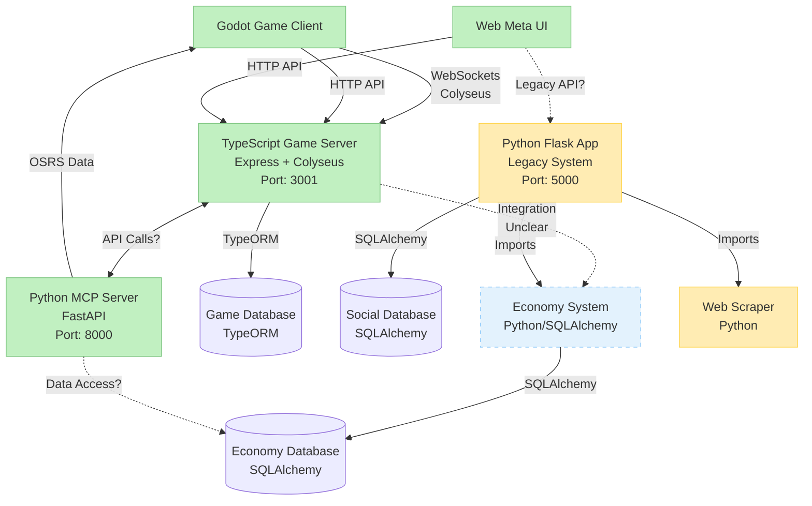

```mermaid
graph TD
    %% Client applications
    Client1[Godot Game Client]
    Client2[Web Meta UI]

    %% Server components
    GameServer[TypeScript Game Server\nExpress + Colyseus\nPort: 3001]
    MCPServer[Python MCP Server\nFastAPI\nPort: 8000]
    FlaskApp[Python Flask App\nLegacy System\nPort: 5000]

    %% Databases and services
    GameDB[(Game Database\nTypeORM)]
    SocialDB[(Social Database\nSQLAlchemy)]
    EconomyDB[(Economy Database\nSQLAlchemy)]

    %% Core systems
    EconomySystem[Economy System\nPython/SQLAlchemy]
    ScraperSystem[Web Scraper\nPython]

    %% Client connections
    Client1 -->|WebSockets\nColyseus| GameServer
    Client1 -->|HTTP API| GameServer
    Client2 -->|HTTP API| GameServer
    Client2 -.->|Legacy API?| FlaskApp

    %% Server interconnections
    GameServer <-->|API Calls?| MCPServer
    GameServer -.->|Integration\nUnclear| EconomySystem
    FlaskApp -->|Imports| ScraperSystem
    FlaskApp -->|Imports| EconomySystem

    %% Database connections
    GameServer -->|TypeORM| GameDB
    FlaskApp -->|SQLAlchemy| SocialDB
    EconomySystem -->|SQLAlchemy| EconomyDB
    MCPServer -.->|Data Access?| EconomyDB

    %% System connections
    MCPServer -->|OSRS Data| Client1

    %% Add notes
    classDef current fill:#c1f0c1,stroke:#81c784
    classDef legacy fill:#ffecb3,stroke:#ffd54f
    classDef unclear fill:#e3f2fd,stroke:#90caf9,stroke-dasharray: 5 5

    class GameServer,MCPServer,Client1,Client2 current
    class FlaskApp,ScraperSystem legacy
    class EconomySystem unclear
```
