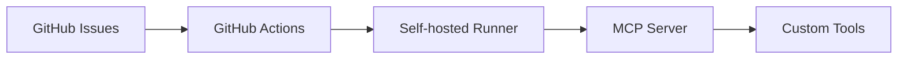
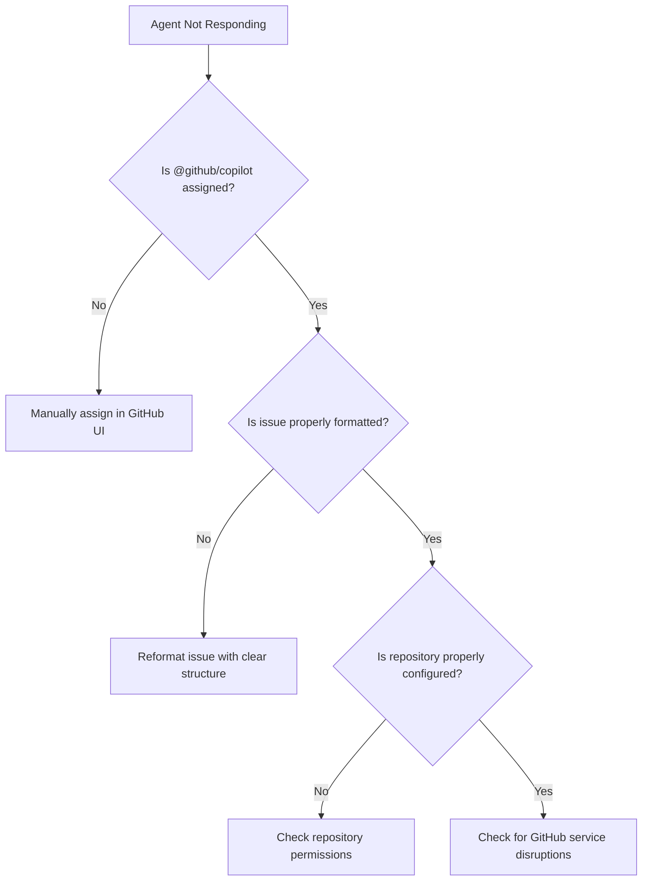

# GitHub Copilot Agents Implementation Next Steps

## Project Context

### Project Overview

The following outlines our progress on GitHub Copilot Agents integration to automate documentation, testing, and code quality tasks. So far, we've:

1. Created a documentation generator script (`scripts/generate_osrs_docs.py`) that works with both markdown and reStructuredText formats
2. Developed a test script for our custom MCP tools (`scripts/test_mcp_tools.js`)
3. Created a GitHub Actions workflow example (`document-osrs-agent.yml`)
4. Fixed markdown lint errors in our documentation files
5. Created comprehensive documentation in `COPILOT_AGENTS_GUIDE.md`

### Project Architecture

Our implementation follows this architecture:



- **GitHub Issues**: Entry point for tasks assigned to GitHub Copilot
- **GitHub Actions**: Workflow automation triggered by issue assignments
- **Self-hosted Runner**: Executes workflows in our controlled environment
- **MCP Server**: Provides custom tools to GitHub Copilot via Model Context Protocol
- **Custom Tools**: Domain-specific tools for documentation, testing, and linting

### Project Goals

Our goal is to complete the implementation and testing of this integration to enable AI-assisted development workflows for our team. The integration should handle:

- Documentation generation for code modules
- Automated testing and reporting
- Code linting and quality checks
- Bug identification and fixes
- Performance optimization suggestions
- Code refactoring assistance

### Technical Stack

- **Frontend**: GitHub UI for issue creation and management
- **Backend**: Node.js for MCP server, Python for tools implementation
- **Infrastructure**: Self-hosted GitHub Actions runner
- **APIs**: GitHub API for issue management, custom APIs for tool execution
- **Security**: Environment variables for sensitive data, access control via GitHub permissions

I need help implementing the remaining components for our GitHub Copilot Agents integration and testing the full workflow. Let's focus on the following key areas:

## 1. MCP Server Implementation

We need to create or enhance our custom MCP server to handle the documentation, testing, and linting tools we've defined. This section provides detailed guidance on implementing a robust MCP server for our GitHub Copilot Agents integration.

### Research and Analysis

#### MCP Architecture Overview

The Model Context Protocol (MCP) enables AI models like GitHub Copilot to interact with external tools and data sources. Key architectural components include:

- **Server**: HTTP server that implements the MCP specification
- **Tools**: Functions that the AI can invoke to perform specific tasks
- **Resources**: Data objects that tools can operate on
- **Authentication**: Mechanisms to secure the MCP server endpoints

#### Best Practices for MCP Implementation

- Use asynchronous processing for long-running tasks
- Implement proper error handling and status reporting
- Design tools with clear, specific purposes rather than general-purpose tools
- Provide detailed descriptions and parameter documentation
- Include examples in tool descriptions to guide the AI
- Use schema validation for input parameters
- Implement rate limiting to prevent abuse

#### Implementation Approaches

| Approach         | Pros                                     | Cons                                           | Best For                                      |
| ---------------- | ---------------------------------------- | ---------------------------------------------- | --------------------------------------------- |
| Direct Execution | Simple implementation, immediate results | Security concerns, limited scalability         | Development environments, internal tools      |
| API-based        | Better security, scalability, monitoring | More complex implementation, potential latency | Production environments, shared tools         |
| Hybrid           | Flexibility, separation of concerns      | Increased complexity                           | Complex workflows with varying security needs |

### Implementation Tasks

**Server Setup**

```javascript
// runerogue-mcp-server.js
const express = require("express");
const bodyParser = require("body-parser");
const cors = require("cors");
const { v4: uuidv4 } = require("uuid");

// Environment variables for security
require("dotenv").config();

const app = express();
app.use(cors());
app.use(bodyParser.json());

// Authentication middleware
const authenticate = (req, res, next) => {
  const apiKey = req.headers["x-api-key"];
  if (!apiKey || apiKey !== process.env.MCP_API_KEY) {
    return res.status(401).json({ error: "Unauthorized" });
  }
  next();
};

// Rate limiting middleware
const rateLimit = require("express-rate-limit");
const limiter = rateLimit({
  windowMs: 15 * 60 * 1000, // 15 minutes
  max: 100, // limit each IP to 100 requests per windowMs
  message: "Too many requests from this IP, please try again later",
});

app.use(limiter);
app.use(authenticate);

// MCP endpoints will be defined here

const PORT = process.env.PORT || 3000;
app.listen(PORT, () => {
  console.log(`MCP Server running on port ${PORT}`);
});
```

#### Custom Tool Implementation

Below are detailed implementations for our custom MCP tools, including both the tool definitions and handler implementations:

##### `generate_docs` Tool

```javascript
// Tool definition with detailed description and examples
const generateDocsToolDefinition = {
  name: "generate_docs",
  description:
    "Generate comprehensive documentation for a specified module in the RuneRogue project",
  parameters: {
    module_path: {
      type: "string",
      description:
        "Path to the module to document (e.g., 'agents/osrs_agent_system.py')",
    },
    output_format: {
      type: "string",
      enum: ["markdown", "rst"],
      description: "Output format for the documentation",
    },
    include_examples: {
      type: "boolean",
      description: "Whether to include usage examples in the documentation",
      default: true,
    },
  },
  examples: [
    {
      description: "Generate markdown documentation for the OSRS agent system",
      parameters: {
        module_path: "agents/osrs_agent_system.py",
        output_format: "markdown",
        include_examples: true,
      },
    },
  ],
};

// Handler implementation
app.post("/tools/generate_docs", async (req, res) => {
  try {
    const { module_path, output_format, include_examples } =
      req.body.parameters;

    // Validate parameters
    if (!module_path) {
      return res.status(400).json({ error: "module_path is required" });
    }

    // Generate a unique job ID for tracking
    const jobId = uuidv4();

    // Log the request
    console.log(
      `[${jobId}] Documentation generation started for ${module_path}`,
    );

    // Start the documentation generation process asynchronously
    const { spawn } = require("child_process");
    const scriptPath = "./scripts/generate_osrs_docs.py";

    const args = [
      scriptPath,
      "--module",
      module_path,
      "--format",
      output_format || "markdown",
    ];

    if (include_examples) {
      args.push("--examples");
    }

    const process = spawn("python", args);

    let outputData = "";
    let errorData = "";

    process.stdout.on("data", (data) => {
      outputData += data.toString();
    });

    process.stderr.on("data", (data) => {
      errorData += data.toString();
    });

    process.on("close", (code) => {
      console.log(
        `[${jobId}] Documentation generation completed with code ${code}`,
      );

      // Store the result for later retrieval
      // In a production environment, use a database or cache
      global.jobResults = global.jobResults || {};
      global.jobResults[jobId] = {
        completed: true,
        success: code === 0,
        output: outputData,
        error: errorData,
        exitCode: code,
      };
    });

    // Return immediately with the job ID
    res.json({
      jobId,
      status: "processing",
      message: `Documentation generation started for ${module_path}`,
    });
  } catch (error) {
    console.error("Error in generate_docs handler:", error);
    res
      .status(500)
      .json({ error: "Internal server error", details: error.message });
  }
});

// Add an endpoint to check job status
app.get("/jobs/:jobId", (req, res) => {
  const { jobId } = req.params;
  const jobResult = global.jobResults?.[jobId];

  if (!jobResult) {
    return res.status(404).json({ error: "Job not found" });
  }

  res.json(jobResult);
});
```

##### `run_tests` Tool

```javascript
// Tool definition with detailed description and examples
const runTestsToolDefinition = {
  name: "run_tests",
  description:
    "Run tests for the specified module or the entire RuneRogue project",
  parameters: {
    module_path: {
      type: "string",
      description: "Path to the module to test, or 'all' for all tests",
    },
    test_type: {
      type: "string",
      enum: ["unit", "integration", "all"],
      description: "Type of tests to run",
      default: "all",
    },
    verbose: {
      type: "boolean",
      description: "Whether to show detailed test output",
      default: false,
    },
  },
  examples: [
    {
      description: "Run all tests for the OSRS agent system",
      parameters: {
        module_path: "tests/test_osrs_agent_system.py",
        test_type: "all",
        verbose: true,
      },
    },
  ],
};

// Handler implementation
app.post("/tools/run_tests", async (req, res) => {
  try {
    const { module_path, test_type, verbose } = req.body.parameters;

    // Generate a unique job ID for tracking
    const jobId = uuidv4();

    // Log the request
    console.log(
      `[${jobId}] Test execution started for ${module_path || "all modules"}`,
    );

    // Start the test execution process asynchronously
    const { spawn } = require("child_process");

    const args = [];

    if (module_path && module_path !== "all") {
      args.push(module_path);
    }

    // Add test type filtering if needed
    if (test_type && test_type !== "all") {
      args.push(`-k=${test_type}`);
    }

    if (verbose) {
      args.push("-v");
    }

    const process = spawn("pytest", args);

    let outputData = "";
    let errorData = "";

    process.stdout.on("data", (data) => {
      outputData += data.toString();
    });

    process.stderr.on("data", (data) => {
      errorData += data.toString();
    });

    process.on("close", (code) => {
      console.log(`[${jobId}] Test execution completed with code ${code}`);

      // Store the result for later retrieval
      global.jobResults = global.jobResults || {};
      global.jobResults[jobId] = {
        completed: true,
        success: code === 0,
        output: outputData,
        error: errorData,
        exitCode: code,
      };
    });

    // Return immediately with the job ID
    res.json({
      jobId,
      status: "processing",
      message: `Test execution started for ${module_path || "all modules"}`,
    });
  } catch (error) {
    console.error("Error in run_tests handler:", error);
    res
      .status(500)
      .json({ error: "Internal server error", details: error.message });
  }
});
```

##### `run_linting` Tool

```javascript
// Tool definition with detailed description and examples
const runLintingToolDefinition = {
  name: "run_linting",
  description:
    "Run linting checks on the specified module or the entire RuneRogue project",
  parameters: {
    module_path: {
      type: "string",
      description: "Path to the module to lint, or 'all' for all modules",
    },
    fix: {
      type: "boolean",
      description: "Whether to automatically fix linting issues",
      default: false,
    },
    report_format: {
      type: "string",
      enum: ["text", "json", "html"],
      description: "Format for the linting report",
      default: "text",
    },
  },
  examples: [
    {
      description: "Run linting on the OSRS agent system and fix issues",
      parameters: {
        module_path: "agents/osrs_agent_system.py",
        fix: true,
        report_format: "text",
      },
    },
  ],
};

// Handler implementation
app.post("/tools/run_linting", async (req, res) => {
  try {
    const { module_path, fix, report_format } = req.body.parameters;

    // Generate a unique job ID for tracking
    const jobId = uuidv4();

    // Log the request
    console.log(
      `[${jobId}] Linting started for ${module_path || "all modules"}`,
    );

    // Start the linting process asynchronously
    const { spawn } = require("child_process");

    const args = [];

    if (module_path && module_path !== "all") {
      args.push(module_path);
    } else {
      args.push(".");
    }

    // Add fix flag if requested
    if (fix) {
      args.push("--fix");
    }

    // Add report format
    if (report_format) {
      args.push(`--format=${report_format}`);
    }

    const process = spawn("flake8", args);

    let outputData = "";
    let errorData = "";

    process.stdout.on("data", (data) => {
      outputData += data.toString();
    });

    process.stderr.on("data", (data) => {
      errorData += data.toString();
    });

    process.on("close", (code) => {
      console.log(`[${jobId}] Linting completed with code ${code}`);

      // Store the result for later retrieval
      global.jobResults = global.jobResults || {};
      global.jobResults[jobId] = {
        completed: true,
        success: code === 0,
        output: outputData,
        error: errorData,
        exitCode: code,
      };
    });

    // Return immediately with the job ID
    res.json({
      jobId,
      status: "processing",
      message: `Linting started for ${module_path || "all modules"}`,
    });
  } catch (error) {
    console.error("Error in run_linting handler:", error);
    res
      .status(500)
      .json({ error: "Internal server error", details: error.message });
  }
});
```

#### MCP Server Registration

```javascript
// Register all tools with the MCP server
app.get("/mcp/tools", (req, res) => {
  res.json({
    tools: [
      generateDocsToolDefinition,
      runTestsToolDefinition,
      runLintingToolDefinition,
    ],
  });
});

// Register the MCP server with GitHub Copilot
// This endpoint provides metadata about the MCP server
app.get("/mcp/info", (req, res) => {
  res.json({
    name: "RuneRogue MCP Server",
    version: "1.0.0",
    description: "Custom MCP server for RuneRogue project automation",
    contact: {
      name: "RuneRogue Team",
      url: "https://github.com/Giftedx/runerogue",
    },
    tools: ["generate_docs", "run_tests", "run_linting"],
  });
});
```

### Security and Error Handling

#### Security Implementation Best Practices

```javascript
// Security best practices for MCP server implementation

// 1. Environment Variables Configuration
// Create a .env file (add to .gitignore) with the following structure:
// MCP_API_KEY=your_secure_api_key
// GITHUB_TOKEN=your_github_token
// RUNNER_TOKEN=your_runner_token

// 2. API Key Rotation System
const apiKeyManager = {
  rotateKeys: async () => {
    // Generate a new API key
    const newKey = crypto.randomBytes(32).toString("hex");

    // Store the new key securely (e.g., in a database)
    await storeNewKey(newKey);

    // Set an expiration date for the key
    const expirationDate = new Date();
    expirationDate.setDate(expirationDate.getDate() + 30); // 30-day expiration

    // Return the new key and its expiration
    return {
      key: newKey,
      expires: expirationDate,
    };
  },

  validateKey: async (providedKey) => {
    // Retrieve valid keys from secure storage
    const validKeys = await getValidKeys();

    // Check if the provided key is valid and not expired
    return validKeys.some(
      (k) => k.key === providedKey && new Date() < k.expires,
    );
  },
};

// 3. Rate Limiting Configuration
const rateLimitConfig = {
  windowMs: 15 * 60 * 1000, // 15 minutes
  max: 100, // limit each IP to 100 requests per windowMs
  standardHeaders: true, // Return rate limit info in the `RateLimit-*` headers
  legacyHeaders: false, // Disable the `X-RateLimit-*` headers
  handler: (req, res) => {
    // Log rate limit exceeded
    console.error(`Rate limit exceeded for IP: ${req.ip}`);

    // Return a standardized error response
    res.status(429).json({
      error: "Too many requests",
      message: "Rate limit exceeded. Please try again later.",
      retryAfter: res.getHeader("Retry-After"),
    });
  },
};
```

#### Error Handling Strategy

```javascript
// Comprehensive error handling for MCP server

// 1. Global Error Handler
app.use((err, req, res, next) => {
  // Log the error
  console.error(`[${new Date().toISOString()}] Error:`, {
    message: err.message,
    stack: err.stack,
    requestId: req.id,
    path: req.path,
    method: req.method,
    ip: req.ip,
  });

  // Determine the appropriate status code
  const statusCode = err.statusCode || 500;

  // Send a standardized error response
  res.status(statusCode).json({
    error: statusCode === 500 ? "Internal Server Error" : err.message,
    requestId: req.id,
    // Only include stack trace in development
    ...(process.env.NODE_ENV === "development" && { stack: err.stack }),
  });
});

// 2. Custom Error Classes
class APIError extends Error {
  constructor(message, statusCode = 400) {
    super(message);
    this.name = this.constructor.name;
    this.statusCode = statusCode;
    Error.captureStackTrace(this, this.constructor);
  }
}

class ValidationError extends APIError {
  constructor(message, validationErrors = []) {
    super(message, 400);
    this.validationErrors = validationErrors;
  }
}

class AuthenticationError extends APIError {
  constructor(message = "Authentication failed") {
    super(message, 401);
  }
}
```

#### Security Recommendations

Based on our security audit, follow these key recommendations:

1. **API Key Management**

   - Never commit API keys directly in `mcp_config.json`
   - Use environment variables for all sensitive data
   - Rotate API keys regularly (at least every 30 days)
   - Use the minimum required permissions for each service

2. **Access Control**

   - Implement IP allowlisting for production environments
   - Use role-based access control for different MCP tools
   - Log all access attempts for security auditing

3. **Data Protection**
   - Encrypt all sensitive data in transit using HTTPS
   - Implement request and response validation
   - Sanitize all inputs to prevent injection attacks
   - Consider using a secrets manager for production environments

## 2. Self-Hosted Runner Configuration

I need guidance on:

- Setting up a self-hosted GitHub Actions runner for our repository
- Configuring the necessary environment variables
- Installing required dependencies (Node.js, Python, etc.)
- Setting up the MCP server to run as a service

## 3. GitHub Actions Workflow Testing

Let's test our workflows:

- Review and enhance our `document-osrs-agent.yml` workflow
- Create additional workflows for testing and linting tasks
- Test the workflow dispatch functionality
- Verify that issues are properly created and formatted

## 4. End-to-End Testing

This section provides a comprehensive end-to-end testing plan for our GitHub Copilot Agents integration, covering all aspects from issue creation to result verification and troubleshooting.

### Test Planning Matrix

| Test Category                | Test Cases                                 | Expected Outcomes                        | Priority |
| ---------------------------- | ------------------------------------------ | ---------------------------------------- | -------- |
| **Documentation Generation** | Generate markdown docs for OSRS Agent      | Complete markdown file with API docs     | High     |
|                              | Generate RST docs with examples            | RST file with formatted examples         | Medium   |
|                              | Generate docs for non-existent module      | Proper error handling and reporting      | Medium   |
| **Test Execution**           | Run all tests for OSRS Agent               | Test report with pass/fail status        | High     |
|                              | Run specific test case with verbose output | Detailed test output with debugging info | Medium   |
|                              | Run tests with intentional failure         | Error report with failure details        | Medium   |
| **Linting**                  | Lint OSRS Agent with auto-fix enabled      | Fixed code with linting report           | High     |
|                              | Lint with specific rule exclusions         | Report showing only relevant issues      | Medium   |
|                              | Lint invalid Python syntax                 | Error report with syntax issues          | Low      |
| **Error Handling**           | Test with invalid API key                  | 401 Unauthorized response                | High     |
|                              | Test with malformed request                | 400 Bad Request with details             | Medium   |
|                              | Test rate limiting                         | 429 Too Many Requests response           | Medium   |

### Test Execution Process

#### 1. Issue Creation and Assignment

```markdown
## Task: Generate Documentation for OSRS Agent System

Please generate comprehensive API documentation for our OSRS Agent System module.

### Requirements

- Source file: `agents/osrs_agent_system.py`
- Output format: Markdown
- Include code examples: Yes
- Output location: `docs/generated/osrs_agent_system.md`

### Additional Notes

- Follow our documentation style guide
- Include class hierarchy diagrams if possible
- Document all public methods and their parameters
```

**Important Notes on Issue Assignment:**

- GitHub Copilot Agent must be explicitly assigned to the issue to trigger agent mode
- This assignment step must be done manually through the GitHub UI
- There is currently no API or GitHub Action that can programmatically assign issues to trigger Copilot's agent mode
- After assignment, Copilot should acknowledge the task within 1-2 minutes

#### 2. Monitoring Execution

Monitor the execution through multiple channels:

1. **GitHub Actions Dashboard**

   - Track workflow execution status
   - View real-time logs
   - Monitor step completion

2. **MCP Server Logs**

   - Check API request/response cycles
   - Monitor tool execution
   - Track job status updates

3. **Self-hosted Runner Logs**
   - Verify environment setup
   - Check for resource constraints
   - Monitor external process execution

#### 3. Result Verification Checklist

- [ ] GitHub Copilot responded to the issue with acknowledgment
- [ ] GitHub Actions workflow executed successfully
- [ ] MCP server processed the request correctly
- [ ] Output artifacts were generated as expected
- [ ] Results were posted back to the issue
- [ ] Any errors were properly reported and documented

### Troubleshooting Common Issues

#### Agent Not Responding



#### Performance Issues

- **Slow Response Time**

  - Break down complex tasks into smaller, focused issues
  - Check for resource constraints on the self-hosted runner
  - Verify MCP server is not overloaded

- **Timeout Errors**
  - Increase timeout settings in GitHub Actions workflow
  - Implement asynchronous processing for long-running tasks
  - Add progress reporting to long-running operations

#### Integration Problems

- **MCP Configuration Issues**

  - Verify environment variables are correctly set
  - Check API key validity and permissions
  - Ensure MCP server is accessible from the runner

- **Tool Execution Failures**
  - Check for missing dependencies
  - Verify file paths and permissions
  - Review tool-specific logs for errors

### Test Reporting Template

```markdown
## End-to-End Test Report

### Test Information

- **Test ID**: [Unique identifier]
- **Test Date**: [Date and time]
- **Tester**: [Name]
- **Issue Reference**: [Link to GitHub issue]

### Test Results

- **Status**: [Success/Failure/Partial]
- **Response Time**: [Time from issue assignment to completion]
- **Artifacts Generated**: [List of generated files]

### Observations

- [Key observations during test execution]

### Issues Identified

- [List of issues found during testing]

### Recommendations

- [Suggestions for improvement]
```

## 5. Security Review

### Security Audit Checklist

This section provides a comprehensive security review process for our GitHub Copilot Agents integration, focusing on critical security aspects of the MCP server and associated components.

#### API Key Management

```javascript
// Implementation of secure API key management

// 1. Environment Variables Setup
// In .env file (NEVER commit to version control)
MCP_API_KEY = your_secure_random_key;
GITHUB_TOKEN = your_github_personal_access_token;

// 2. Key Rotation Schedule Implementation
const keyRotationSchedule = {
  // Set up a cron job to rotate keys automatically
  setupKeyRotation: () => {
    const cron = require("node-cron");

    // Schedule key rotation every 30 days
    cron.schedule("0 0 1 * *", async () => {
      console.log("Performing scheduled API key rotation");
      try {
        // Generate and store new key
        const newKey = await apiKeyManager.rotateKeys();

        // Log rotation (to secure audit log)
        console.log(`API key rotated successfully. Expires: ${newKey.expires}`);

        // Notify administrators
        await notifyAdmins("API key rotated successfully", {
          expirationDate: newKey.expires,
          rotationDate: new Date(),
        });
      } catch (error) {
        console.error("Failed to rotate API key:", error);
        // Send alert to administrators
        await alertAdmins("API key rotation failed", error);
      }
    });
  },
};
```

#### Access Control Implementation

```javascript
// Implement role-based access control for MCP tools

const accessControlRules = {
  // Define roles and their permissions
  roles: {
    admin: ["read", "write", "execute", "configure"],
    developer: ["read", "execute"],
    viewer: ["read"],
  },

  // Check if a user has permission for a specific action
  hasPermission: (user, action) => {
    if (!user || !user.role) return false;
    const allowedActions = accessControlRules.roles[user.role] || [];
    return allowedActions.includes(action);
  },

  // Middleware to check permissions for specific endpoints
  checkPermission: (action) => {
    return (req, res, next) => {
      // Get user from authentication middleware
      const user = req.user;

      if (!accessControlRules.hasPermission(user, action)) {
        return res.status(403).json({
          error: "Forbidden",
          message: `You don't have permission to ${action} this resource`,
        });
      }

      next();
    };
  },
};
```

#### Security Audit Process

Follow this systematic approach to audit our MCP implementation:

1. **Configuration Review**

   - [ ] Verify all API keys are stored in environment variables, not in code
   - [ ] Confirm `.env` files are in `.gitignore`
   - [ ] Check that minimum required permissions are used for each service
   - [ ] Review rate limiting configuration to prevent abuse

2. **Code Security Analysis**

   - [ ] Run automated security scanning tools (SAST)
   - [ ] Check for input validation on all endpoints
   - [ ] Verify proper error handling without information leakage
   - [ ] Review authentication implementation

3. **Dependency Audit**

   - [ ] Run `npm audit` to check for vulnerable dependencies
   - [ ] Update all packages to secure versions
   - [ ] Review third-party library usage and permissions

4. **Infrastructure Security**

   - [ ] Verify HTTPS is used for all communications
   - [ ] Check that the self-hosted runner is properly secured
   - [ ] Ensure network access to the MCP server is restricted
   - [ ] Review GitHub repository permissions

#### Security Implementation Recommendations

Based on our security audit findings, implement these key recommendations:

1. **API Key Management**

   - Never commit API keys directly in `mcp_config.json` or any code files
   - Use environment variables for all sensitive data
   - Rotate API keys regularly (at least every 30 days)
   - Use the minimum required permissions for each service
   - Consider using a secrets manager for production environments

2. **Access Control**

   - Implement IP allowlisting for production environments
   - Use role-based access control for different MCP tools
   - Log all access attempts for security auditing
   - Implement proper session management

3. **Data Protection**

   - Encrypt all sensitive data in transit using HTTPS
   - Implement request and response validation
   - Sanitize all inputs to prevent injection attacks
   - Limit the exposure of sensitive information in logs

4. **Monitoring and Incident Response**
   - Set up logging for security events
   - Create an incident response plan
   - Implement alerts for suspicious activities
   - Conduct regular security reviews

## 6. Documentation Finalization

### Documentation Strategy

This section outlines our approach to finalizing comprehensive documentation for the GitHub Copilot Agents integration, ensuring it meets the needs of all stakeholders.

#### Documentation Components

| Document                   | Purpose                                            | Target Audience                 | Priority |
| -------------------------- | -------------------------------------------------- | ------------------------------- | -------- |
| `COPILOT_AGENTS_GUIDE.md`  | Comprehensive guide to using GitHub Copilot Agents | Developers, Project Managers    | High     |
| `README.md` Updates        | Project overview and quick start                   | All stakeholders                | High     |
| Troubleshooting Guide      | Solutions for common issues                        | Support team, Developers        | Medium   |
| Architecture Documentation | Technical details of implementation                | Technical leads, New developers | Medium   |
| Security Guidelines        | Security best practices                            | Security team, Developers       | High     |

#### Documentation Enhancement Plan

1. **COPILOT_AGENTS_GUIDE.md Enhancements**

   ```markdown
   # GitHub Copilot Agents Guide

   ## Overview

   This guide provides comprehensive documentation for using GitHub Copilot Agents in the RuneRogue project.

   ## Table of Contents

   1. [Introduction](#introduction)
   2. [Setup and Configuration](#setup-and-configuration)
   3. [Creating Tasks](#creating-tasks)
   4. [Task Templates](#task-templates)
   5. [Monitoring and Results](#monitoring-and-results)
   6. [Troubleshooting](#troubleshooting)
   7. [Best Practices](#best-practices)
   8. [Advanced Usage](#advanced-usage)
   9. [FAQ](#faq)

   ## Introduction

   GitHub Copilot Agents extend the capabilities of GitHub Copilot to perform complex tasks through GitHub Issues...
   ```

2. **README.md Updates**

   ```markdown
   ## GitHub Copilot Agents Integration

   This project includes integration with GitHub Copilot Agents for automated documentation, testing, and code quality tasks. Key features include:

   - Documentation generation for code modules
   - Automated testing and reporting
   - Code linting and quality checks
   - Bug identification and fixes

   For detailed information, see our [GitHub Copilot Agents Guide](docs/COPILOT_AGENTS_GUIDE.md).
   ```

3. **Troubleshooting Guide**

   ```markdown
   # Troubleshooting Guide

   ## Common Issues and Solutions

   ### Agent Not Responding

   **Symptoms:**

   - No response from GitHub Copilot after issue assignment
   - No workflow triggered in GitHub Actions

   **Possible Causes and Solutions:**

   1. **Incorrect Assignment**

      - Verify @github/copilot is correctly assigned to the issue
      - Check repository permissions for GitHub Copilot

   2. **Issue Format Problems**

      - Ensure the issue follows the required template format
      - Check for any special characters that might cause parsing issues

   3. **GitHub Service Issues**
      - Check GitHub status page for any service disruptions
      - Wait and retry if service issues are detected
   ```

#### Known Limitations Documentation

Document the following known limitations to set appropriate expectations:

1. **Manual Assignment Requirement**

   - GitHub Copilot must be manually assigned to issues through the GitHub UI
   - There is currently no API or GitHub Action that can programmatically assign issues to trigger Copilot's agent mode

2. **Performance Constraints**

   - Complex tasks may require breaking down into smaller issues
   - Resource-intensive operations may time out in GitHub Actions

3. **Tool Limitations**

   - Document specific limitations of each custom tool
   - Include workarounds for known edge cases

4. **Integration Boundaries**
   - Clearly document what can and cannot be automated
   - Provide guidance on when human intervention is necessary

## 7. Team Training Materials

### Training Strategy

This section outlines our comprehensive approach to team training for the GitHub Copilot Agents integration, ensuring all team members can effectively leverage this technology.

#### Training Components

| Component                   | Format                   | Duration   | Target Audience | Priority |
| --------------------------- | ------------------------ | ---------- | --------------- | -------- |
| Getting Started Workshop    | Interactive session      | 2 hours    | All developers  | High     |
| Task Creation Guide         | Documentation + Examples | Self-paced | Task creators   | High     |
| Prompt Engineering Workshop | Hands-on training        | 3 hours    | Task creators   | Medium   |
| Advanced Usage Patterns     | Case studies             | Self-paced | Advanced users  | Low      |
| Troubleshooting Session     | Q&A + Examples           | 1 hour     | Support team    | Medium   |

#### Effective Task Creation Guide

````markdown
# Creating Effective Tasks for GitHub Copilot Agents

## Task Structure Best Practices

1. **Clear Objective Statement**

   - Begin with a concise statement of what needs to be accomplished
   - Example: "Generate comprehensive documentation for the OSRS agent system module"

2. **Detailed Context**

   - Provide relevant background information
   - Specify which files or components are involved
   - Include any dependencies or constraints

3. **Expected Deliverables**

   - Clearly define what outputs are expected
   - Specify format requirements (markdown, code, etc.)
   - Include any specific sections that must be included

4. **Success Criteria**
   - Define how to determine if the task was completed successfully
   - Include any validation steps or quality checks

## Example Tasks

### Documentation Generation Task

```markdown
Title: Generate Documentation for OSRS Agent System

Objective: Create comprehensive documentation for the OSRS agent system module.

Context:

- The module is located at `agents/osrs_agent_system.py`
- It implements a multi-agent system using the autogen framework
- Documentation should cover the agent roles, interactions, and configuration

Deliverables:

1. Markdown documentation file with module overview
2. Class and function documentation with parameters and return values
3. Usage examples
4. Diagrams of agent interactions (text-based is acceptable)

Success Criteria:

- Documentation follows project standards
- All public classes and functions are documented
- Documentation is accurate and reflects current implementation
```
````

### Code Linting Task

```markdown
Title: Perform Code Linting and Quality Improvements

Objective: Identify and fix code quality issues in the specified module.

Context:

- The module is located at `game/combat_system.py`
- Follow PEP 8 standards for Python code
- Maintain existing functionality while improving code quality

Deliverables:

1. List of identified issues with line numbers
2. Fixed code with comments explaining changes
3. Summary of improvements made

Success Criteria:

- Code passes flake8 with no errors
- Functionality remains unchanged
- Code is more readable and maintainable
```

### Prompt Engineering Workshop Materials

Create a workshop that covers these key prompt engineering concepts:

1. **Specificity vs. Flexibility**

   - When to be highly specific vs. when to allow creative freedom
   - Examples of both approaches and their outcomes

2. **Context Optimization**

   - How to provide just enough context without overwhelming
   - Techniques for referencing existing code effectively

3. **Iterative Refinement**

   - Starting with basic tasks and building complexity
   - How to analyze and improve based on previous results

4. **Task Decomposition**

   - Breaking complex tasks into manageable sub-tasks
   - Creating dependencies between tasks

5. **Hands-on Exercises**
   - Practice writing prompts for common scenarios
   - Peer review and improvement of prompts

### Implementation Checklist

- [ ] Schedule initial training sessions
- [ ] Create and distribute documentation guides
- [ ] Record training sessions for asynchronous learning
- [ ] Establish a feedback mechanism for training materials
- [ ] Create a repository of example tasks and outcomes
- [ ] Develop a certification process for task creators

### Quick-Start Guide Development

**Research and Planning:**

- Analyze the team's current knowledge level of GitHub Copilot and AI tools
- Identify the most common tasks team members will perform
- Research effective quick-start guide formats from similar tools

**Implementation Strategy:**

```markdown
# GitHub Copilot Agents Quick-Start Guide

## Setup (15 minutes)

1. [ ] Verify GitHub access permissions
2. [ ] Configure local environment
3. [ ] Test connection to self-hosted runner

## Creating Your First Task (10 minutes)

1. [ ] Navigate to Issues in the repository
2. [ ] Select the Copilot Agent task template
3. [ ] Fill in the required information
4. [ ] Assign to GitHub Copilot

## Monitoring and Results

1. [ ] View task progress in GitHub Actions
2. [ ] Interpret Copilot's responses
3. [ ] Access generated artifacts
```

### Example Tasks Library

**Task Categories to Cover:**

- Documentation generation tasks
- Code testing and quality assurance
- Refactoring and optimization
- Bug investigation and fixing

**Example Task Structure:**

```markdown
## Documentation Generation Example

### Task Title

Generate API documentation for the OSRS Agent System

### Task Description

I need comprehensive API documentation for our OSRS Agent System module. Please analyze the code in `agents/osrs_agent_system.py` and generate markdown documentation that includes:

- Module overview
- Class and function descriptions
- Parameter details
- Usage examples

Please follow our documentation style guide and save the output to `docs/generated/`.

### Expected Outcome

A complete markdown file with well-structured API documentation that follows our project standards.
```

### Prompt Engineering Guide

**Key Components:**

- Task specificity principles
- Context provision guidelines
- Effective constraint definition
- Output format specification

**Research-Based Approach:**

- Analyze successful vs. unsuccessful prompts from our testing
- Incorporate best practices from GitHub's official documentation
- Create a pattern library of effective prompts for common tasks

**Example Section:**

```markdown
## Effective Prompt Structure

### 1. Clear Task Definition

Start with a concise statement of what needs to be accomplished.

Weak: "I need documentation."
Strong: "Generate comprehensive markdown documentation for the OSRS Agent System module."

### 2. Contextual Information

Provide relevant context that helps Copilot understand the task environment.

Weak: "Fix the bugs in the code."
Strong: "Fix the input validation bugs in the user authentication module that allow empty passwords."

### 3. Specific Constraints

Clearly define any limitations or requirements.

Weak: "Make it secure."
Strong: "Ensure the implementation follows OWASP security guidelines, particularly for input sanitization."
```

### Implementation Prioritization

Based on team needs and project timeline, I recommend this implementation order:

1. **Quick-Start Guide** - Highest priority to enable immediate team adoption
2. **Example Tasks Library** - Provides practical templates for common use cases
3. **Prompt Engineering Guide** - Helps optimize the quality of tasks assigned to Copilot
4. **FAQ Document** - Can be developed iteratively as questions arise during actual usage

This prioritization focuses on getting the team productive quickly while building more advanced resources as the integration matures.

## 8. Conclusion and Final Recommendations

### Key Implementation Priorities

Based on our comprehensive analysis, here are the prioritized next steps for successful GitHub Copilot Agents integration:

1. **MCP Server Implementation**

   - Complete the server with all required custom tools
   - Ensure proper error handling and logging
   - Implement comprehensive security measures

2. **Security Implementation**

   - Never commit API keys directly in `mcp_config.json` or any code files
   - Use environment variables for all sensitive data
   - Rotate API keys regularly (at least every 30 days)
   - Use the minimum required permissions for each service
   - Consider using a secrets manager for production environments
   - Implement IP allowlisting for production environments

3. **Testing and Validation**

   - Execute the comprehensive end-to-end testing plan
   - Document all test results and observations
   - Address any issues identified during testing

4. **Documentation and Training**

   - Finalize all documentation with practical examples
   - Conduct training sessions for different team roles
   - Create a repository of example tasks and outcomes

5. **Operational Considerations**
   - Establish a monitoring and maintenance plan
   - Create a feedback loop for continuous improvement
   - Develop incident response procedures for integration issues

### Effective Usage Patterns

For optimal results with GitHub Copilot Agents, follow these best practices:

1. **Task Structure**

   - Break down large tasks into smaller, focused issues
   - Provide clear acceptance criteria
   - Include relevant code context

2. **Prompt Engineering**

   - Be specific and detailed in your requests
   - Include example inputs/outputs when relevant
   - Specify the programming language and frameworks

3. **Context Provision**

   - Reference specific files/functions
   - Include error messages for debugging tasks
   - Provide sample data formats when applicable

4. **Task Assignment Process**
   - Create GitHub Issues with clear titles
   - Use labels for categorization
   - Manually assign to @github/copilot (this step cannot be automated)
   - Track progress through issue comments

By following these guidelines and implementing the recommended security measures, the team will be able to effectively leverage GitHub Copilot Agents to enhance productivity and code quality in the RuneRogue project.
